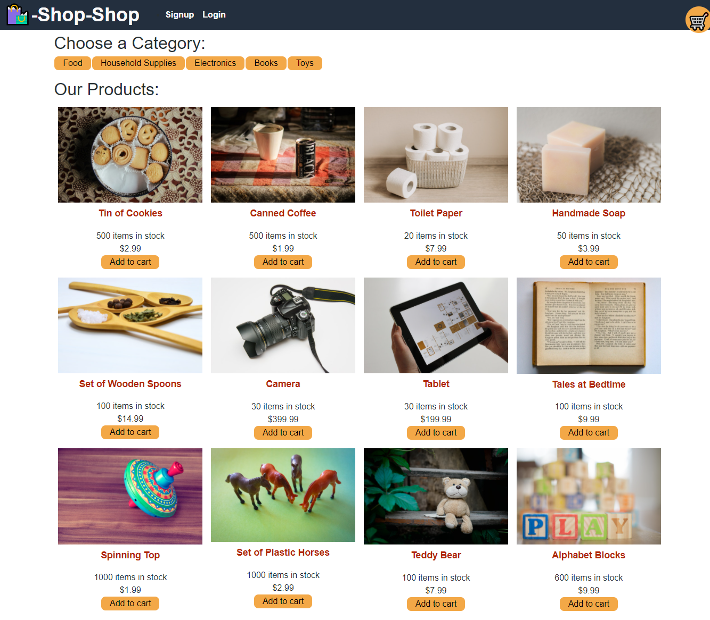

# Shop-Shop

## Description

A sample ecommerce site that uses MongoDB and GraqphQL to load items from the back-end to display on the page. Users can select items for the cart, and then use Strip to checkout.

The application is available at [quasse-shop.herokuapp.com/](https://quasse-shop.herokuapp.com/).

## Screenshot

## Installation

Clone Github repository, use npm install to install dependencies.

## Contribution

Made with Bootcamp starter code.

Sam Morgen refactored code from React Context to Redux
